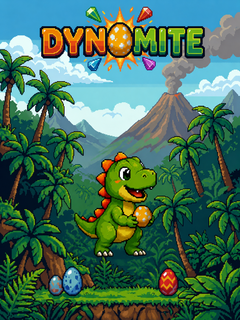
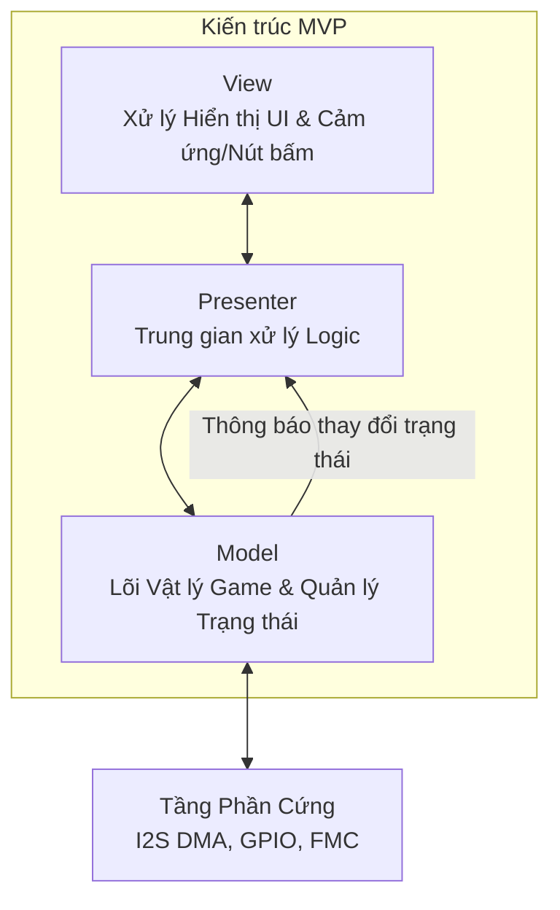
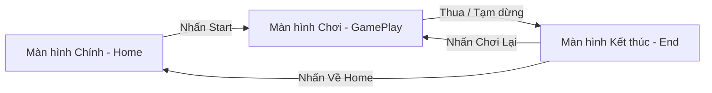

<div align="center">
  
  <h1>🦖 Dynomite STM32F429I-DISCO</h1>
  <p><i>Tựa game bắn trứng khủng long kinh điển (Dynomite) được xây dựng hoàn toàn từ đầu trên vi điều khiển STM32, sử dụng đồ họa TouchGFX và hệ thống xử lý âm thanh tăng tốc phần cứng.</i></p>
  
  [](https://www.st.com/en/evaluation-tools/32f429idiscovery.html)
  [](https://www.st.com/en/embedded-software/x-cube-touchgfx.html)
  []()
</div>

---

## 🎬 Video Demo
Xem trực tiếp gameplay của dự án! 

<div align="center">
  <video src="resources/DynomiteGame.mp4" width="600" controls></video>
</div>

> *Lưu ý: Nếu video trên không tự động phát trên GitHub, bạn có thể tải xuống và xem trực tiếp từ đường dẫn `resources/DynomiteGame.mp4`.*

---

## 📖 Mục lục
- [Tính năng nổi bật](#-tính-năng-nổi-bật)
- [Kiến trúc Phần cứng](#-kiến-trúc-phần-cứng)
- [Kiến trúc Phần mềm](#-kiến-trúc-phần-mềm)
- [Hệ thống Âm thanh](#-hệ-thống-âm-thanh)
- [Thuật toán & Logic Game](#-thuật-toán--logic-game)
- [Quản lý Bộ nhớ](#-quản-lý-bộ-nhớ)
- [Hướng dẫn Cài đặt & Chạy](#-hướng-dẫn-cài-đặt--chạy)
- [Thành viên Nhóm & Lời cảm ơn](#-thành-viên-nhóm--lời-cảm-ơn)

---

## ✨ Tính năng nổi bật
- **Đồ họa mượt mà 60 FPS:** Sử dụng kỹ thuật Double Buffering với bộ nhớ ngoài SDRAM và bộ tăng tốc đồ họa DMA2D.
- **Hệ thống Âm thanh Nâng cao:** Bộ trộn âm thanh (Software Mixer) thời gian thực hỗ trợ cùng lúc 1 kênh Nhạc nền (BGM) và 3 kênh Hiệu ứng (SFX).
- **Điều khiển Phần cứng:** Hỗ trợ điều khiển song song qua Màn hình Cảm ứng và 4 Nút bấm vật lý (Trái, Phải, Bắn, Đổi bóng).
- **Cơ chế Game Chuẩn mực:** Bám lưới tổ ong (Hexagonal grid), dội tường, nổ bóng (Match-3) và rụng bóng mồ côi (Orphan-dropping).

---

## 🛠 Kiến trúc Phần cứng

Trò chơi được chạy trên kit phát triển **STM32F429I-Discovery** (nhân ARM Cortex-M4 hoạt động ở xung nhịp 180MHz).

| Linh kiện | Chân MCU / Giao tiếp | Mô tả chi tiết |
| :--- | :--- | :--- |
| **Màn hình** | LTDC (RGB565) | LCD TFT 2.4" dùng để render giao diện đồ họa. |
| **Amply Audio**| I2S3 (PC10, PC12, PA15) | Bộ khuếch đại Class-D MAX98357A giao tiếp qua I2S để phát ra loa ngoài. |
| **Nút: Đổi bóng** | PA5 (GPIO In, Pull-up) | Đổi giữa quả bóng hiện tại và quả bóng dự bị. |
| **Nút: Bắn** | PA7 (GPIO In, Pull-up) | Thực hiện thao tác bắn bóng. |
| **Nút: Trái** | PG2 (GPIO In, Pull-up) | Dịch chuyển góc ngắm sang trái. |
| **Nút: Phải** | PG3 (GPIO In, Pull-up) | Dịch chuyển góc ngắm sang phải. |

### Quét tín hiệu nút bấm (Polling)
Để tránh các vấn đề tranh chấp luồng (Context Switching/Race Condition) do ngắt (ISR) gây ra với luồng giao diện của TouchGFX, các nút bấm được quét bằng cơ chế **Polling 60Hz** đồng bộ hoàn toàn với tốc độ dựng hình (frame rate) của màn hình.

---

## 🏗 Kiến trúc Phần mềm

Giao diện người dùng được xây dựng bằng **TouchGFX** và tuân thủ chặt chẽ mẫu thiết kế **Model-View-Presenter (MVP)**.



### Luồng chuyển Màn hình (Screen Flow)


---

## 🎵 Hệ thống Âm thanh

Việc xử lý âm thanh chất lượng cao trên một Vi điều khiển có bộ nhớ hạn chế là một thách thức lớn. Dự án này tự xây dựng một engine âm thanh (Audio Engine) chuyên biệt:

1. **Giải mã ADPCM thời gian thực (On-The-Fly):** 
   Nhạc nền (BGM) được nén bằng thuật toán ADPCM 4-bit, giúp giảm **75%** dung lượng bộ nhớ (một bản nhạc 1 phút chỉ chiếm khoảng ~500KB Flash nội). Nhân Cortex-M4 sẽ đảm nhiệm việc giải mã theo thời gian thực.
2. **Bộ trộn âm thanh mềm (Software Mixing):** 
   Engine thực hiện trộn 1 kênh nhạc nền ADPCM và 3 kênh hiệu ứng SFX (định dạng PCM 16-bit thô) đồng thời.
3. **Double Buffering I2S qua DMA (Ping-Pong):**
   Một bộ đệm (buffer) tĩnh 4096-sample được chia làm hai nửa. Trong khi phần cứng DMA truyền nửa A ra loa (MAX98357A), CPU sẽ tiến hành giải mã và trộn âm thanh vào nửa B, tạo ra trải nghiệm âm thanh liên tục với độ trễ bằng 0.
4. **Đầu ra Mono qua chuẩn Stereo I2S:** 
   Chuẩn I2S mặc định truyền dữ liệu Stereo (Trái + Phải). Để phát ra một loa duy nhất, engine sao chép cùng một mẫu âm thanh vào cả `buffer[i]` (Trái) và `buffer[i+1]` (Phải), tạo ra tín hiệu Mono cân bằng tuyệt đối.

---

## 🧠 Thuật toán & Logic Game

### 1. Hệ thống Lưới lục giác (Hexagonal Grid)
Các quả trứng được quản lý bằng mảng 2 chiều, nhưng hiển thị trên màn hình dưới dạng **Lưới tổ ong (Hex Grid)**. Các hàng chẵn và lẻ được xếp so le nhau (lệch trục X một khoảng `0.5 * CELL_WIDTH`) để tạo độ đan xen chặt chẽ.
- Bảng tra cứu (LUT) `NEIGHBOR_OFFSETS[2][6][2]` được tính toán sẵn giúp tìm kiếm 6 quả trứng lân cận của bất kỳ ô nào với độ phức tạp $O(1)$, có xét đến tính chẵn lẻ của từng hàng.

### 2. Thuật toán Nổ bóng Match-3 (Breadth-First Search)
Khi bóng bay chạm trần hoặc va vào quả bóng khác, nó sẽ tự động bắt lưới (snap). Ngay lập tức, thuật toán **BFS (Flood-fill)** được kích hoạt:
- Loang ra 6 hướng lân cận để tìm tất cả các quả bóng cùng màu kết nối với nhau.
- Nếu tập hợp tìm được có số lượng $\ge 3$ quả, chúng sẽ bị tiêu diệt, hệ thống cộng điểm và phát âm thanh nổ.

### 3. Nhận diện Bóng rớt (Orphan Drop Detection)
Khi một chùm bóng bị nổ, một số quả bóng khác có thể bị đứt liên kết với trần nhà. Quá trình quét **BFS lần 2** được gọi để phát hiện các quả bóng "mồ côi" này:
- Bắt đầu quét từ tất cả các quả bóng dính trên trần (Hàng 0).
- Đánh dấu tất cả các quả bóng có thể đi tới được là "an toàn".
- Những quả bóng còn lại không được đánh dấu sẽ rụng xuống đáy màn hình và được tính điểm thưởng combo.

### 4. Cơ chế Ngắm bắn & Vật lý
- **Bộ lọc nhiễu (Low-Pass Filter):** Dữ liệu cảm ứng ngắm bắn được làm mượt bằng công thức trung bình động hàm mũ (`smoothedAim += (rawAim - smoothedAim) * 0.3`), giúp thanh dự đoán quỹ đạo hiển thị cực kỳ mềm mại, không bị giật lag.
- **Tối ưu Tính toán Va chạm:** Thay vì dùng hàm tính căn bậc hai (`sqrt()`) cực kỳ tốn CPU để đo khoảng cách, engine so sánh trực tiếp bình phương khoảng cách (`dx*dx + dy*dy <= RADIUS_SQ`). Kỹ thuật này tiết kiệm một lượng lớn chu kỳ máy.
- **Dội tường:** Xử lý vật lý dội biên đơn giản bằng cách đảo dấu vận tốc trục X (`vx = -vx`) khi hộp giới hạn (Bounding Box) của quả bóng chạm `LEFT_WALL` hoặc `RIGHT_WALL`.

---

## 💾 Quản lý Bộ nhớ

Vi điều khiển STM32F429 chỉ có **256KB SRAM nội** và **2MB Flash nội**.
- **Framebuffers (Khung hình):** Hai khung hình RGB565 `240x320` cần tổng cộng `307.2 KB`. Mức này vượt quá SRAM nội, do đó chúng được chuyển ra vùng nhớ **8MB SDRAM ngoại** thông qua bộ điều khiển FMC.
- **Tài nguyên Game (Assets):** Toàn bộ hình ảnh, nhạc nền ADPCM, và hiệu ứng PCM được lưu cứng vào **2MB Flash nội**. Tổng dung lượng tài nguyên được tối ưu gắt gao để nằm gọn trong khoảng ~1.5MB.
- **SRAM Nội bộ:** Được giữ lại độc quyền cho Runtime Heap, Stack của TouchGFX, trạng thái lưới game, và bộ đệm âm thanh Audio DMA để đảm bảo tốc độ truy xuất nhanh nhất (Zero-wait state).

---

## 🚀 Hướng dẫn Cài đặt & Chạy

### Yêu cầu Công cụ
- STM32CubeIDE phiên bản 1.15.0 trở lên
- TouchGFX Designer 4.25.0
- Kit vi điều khiển STM32F429I-Discovery

### Các bước thực hiện
1. Clone repository này về máy:
   ```bash
   git clone https://github.com/DuongAn15/DynomiteGame.git
   ```
2. Mở thư mục dự án bằng phần mềm **STM32CubeIDE**.
3. Tiến hành Compile (Biên dịch) dự án bằng cấu hình **Release** hoặc **Debug**.
4. Nạp (Flash) file `.elf` sinh ra vào kit STM32F429I-DISCO thông qua mạch nạp ST-LINK.
5. *(Tùy chọn)* Để chỉnh sửa giao diện người dùng, hãy mở file `TouchGFX/SimpleRacingNew.touchgfx` (tên file nội bộ của dự án) bằng TouchGFX Designer và nhấn nút **Generate Code**.

---

## 👥 Thành viên Nhóm & Lời cảm ơn

Dự án này được phát triển bởi nhóm **HAN Embedded** - là Bài Tập Lớn kết thúc môn học Hệ Nhúng (IT4210) tại Trường Công nghệ Thông tin và Truyền thông, Đại học Bách Khoa Hà Nội (HUST - SOICT).

- **Trần Dương An (20235256):** Thiết lập phần cứng (GPIO, I2S, DMA), Luồng Giao diện, Kiến trúc Tổng thể.
- **Nguyễn Đào Nam Hải (20235321):** Engine Âm thanh (Giải mã ADPCM, Trộn âm DMA, Tích hợp BGM/SFX).
- **Đào Trọng Nguyên (20235390):** Vật lý Game, Logic Lưới lục giác, Thuật toán BFS Match-3, Thiết kế UI TouchGFX.

Giảng viên hướng dẫn: **TS. Ngô Lam Trung**

<div align="center">
  <i>Được làm bằng tất cả tâm huyết ❤️ từ HAN Embedded Group</i>
</div>
