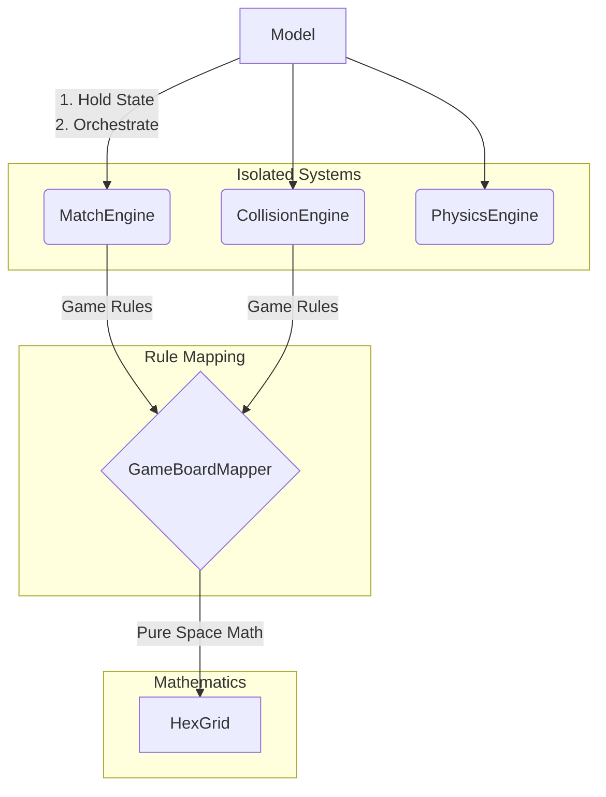

# Báo cáo Phase 2.5: Architecture Consolidation

## 1. Before/After Dependency Graph

**[Before]**
- `Model.cpp` ôm đồm: Quản lý GameState, tự thực hiện vòng lặp BFS/DFS, tự tính toán khoảng cách va chạm bằng vòng lặp `for`.
- `HexGrid` bị rò rỉ trách nhiệm: Trộn lẫn toán hình học thuần túy (`index`) với luật chơi (`gridParityOffset`, `headRowIndex`).
- `MatchEngine` tự chứa logic mapping `computePhysicalIndex` và ép các engine khác phải mượn.

**[After]**
- **`HexGrid`**: Tầng nền tảng tuyệt đối (Pure Math). Chỉ chứa hình học lục giác không gian. Không bị phụ thuộc bởi luật chơi.
- **`GameBoardMapper`**: Tầng dịch thuật luật chơi (Rule Mapping). Dùng `HexGrid` để nội suy mảng tuyến tính vật lý với cơ chế cuộn của `Model`.
- **`CollisionEngine` / `PhysicsEngine` / `MatchEngine`**: Tầng Engine logic độc lập (Isolated Gameplay Systems). Gọi `GameBoardMapper` để giải mã tọa độ, tự thực hiện thuật toán không giữ state.
- **`Model`**: Tầng điều phối (Orchestration). Nắm giữ con trỏ mảng, truyền tham số cho Engine tính toán, cập nhật điểm/GameState từ kết quả trả về.

## 2. Moved Logic Mapping Table

| Nguồn ban đầu (Origin) | Logic được bóc tách | Nơi tiếp nhận (Destination) | Phân quyền mới |
|---|---|---|---|
| `Model::isCollisionAt` | Toán học Penalty, Vòng lặp dò điểm lưới lân cận | `CollisionEngine::computeCollisionAt` | Collision System |
| `Model::snapToGrid` | Phép tính khoảng cách Euclid gần nhất trên lưới | `CollisionEngine::resolveSnapToGrid` | Collision System |
| `Model::checkMatches` | Thuật toán BFS quét cụm trứng | `MatchEngine::computeMatches` | Match System |
| `Model::dropFloatingEggs` | Thuật toán DFS quét trứng mồ côi | `MatchEngine::resolveFloatingEggs` | Match System |
| `HexGrid::isEvenRow` | Xử lý chẵn lẻ theo `parityOffset` | `GameBoardMapper::isLogicalRowEven` | Rule Mapping |
| `MatchEngine::computePhysicalIndex` | Công thức Ring Buffer với `headRowIndex` | `GameBoardMapper::computePhysicalIndex` | Rule Mapping |
| `HexGrid::pixelToNearestCell` | Bắt điểm ảnh (pixel) và ép về lưới bù `parityOffset` | `GameBoardMapper::pixelToNearestCell` | Rule Mapping |

## 3. Duplication Removal List

- **Xóa bỏ trùng lặp BFS/DFS Queue & Stack**: Các khai báo `qHead`, `qTail`, `top`, `algoQueueStack` trước đây bị nhân đôi ở nhiều hàm trong `Model`, nay chỉ được đặt tĩnh một lần trong `MatchEngine`.
- **Xóa bỏ trùng lặp Validation Lưới**: Logic kiểm tra phần tử biên `r < 0 || r >= MAX_ROWS` và ranh giới tổ ong `maxCol` đã được quy về duy nhất `HexGrid::isValidCell` và được các Engine kế thừa thông qua `GameBoardMapper`.
- **Xóa bỏ trùng lặp Physical Index**: Hàm lấy địa chỉ ô mảng vật lý `getPhysicalIndex` từ `Model` (khi vẽ hoặc khởi tạo) và từ `MatchEngine` (khi tìm BFS) nay được quy về một mối là `GameBoardMapper::computePhysicalIndex`. 

## 4. Final Architecture Diagram

## 5. Confirmation
**"Model contains no mathematical logic"** - Xác nhận 100%. `Model.cpp` chỉ còn chứa các phép gán biến trạng thái, câu lệnh điều kiện rẽ nhánh UI (`GameState::STATE_WIN`, `LOSE`, `IDLE`), và các lời gọi hàm trừu tượng đến hệ thống tĩnh (Engines). Khối lượng code vật lý và toán học của `Model.cpp` đã giảm từ hơn 800 dòng xuống chỉ còn dưới 300 dòng điều phối thuần túy.
