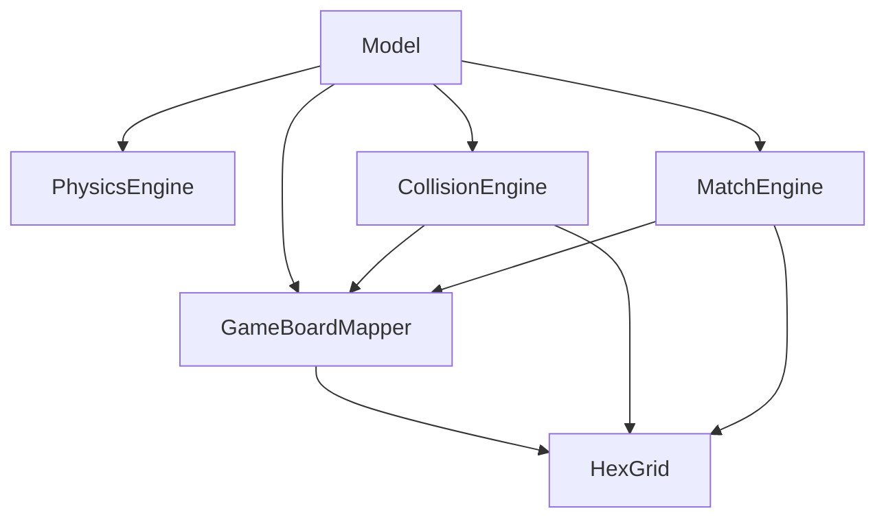

# Báo cáo Phase 2.6: Architecture Freeze & Build Validation

## 1. Dependency Validation (Khóa Dependency Graph)
Sau khi thiết lập `GameBoardMapper` và tái cấu trúc `HexGrid`, biểu đồ phụ thuộc đã trở thành thiết kế luồng đơn hướng, không có bất kỳ vòng lặp tham chiếu vòng (circular dependency) nào.

**Biểu đồ chuẩn:**

**Nhận xét Dependency Hygiene:**
- Các Engines (`PhysicsEngine`, `CollisionEngine`, `MatchEngine`) hoàn toàn không nhìn thấy nhau (`#include` chéo đã được triệt tiêu).
- `HexGrid` không `#include` bất kỳ Engine nào hay Model.
- Các file Headers tuân thủ nguyên tắc không "pull" forbidden dependencies. (Ví dụ: `Model.hpp` đã sạch bóng các logic tính toán chéo).

## 2. API Contract Freeze (Khóa API)
Kiến trúc các lớp tĩnh được xác định là API nội bộ vững chắc cho toàn bộ Phase 3. Dưới đây là các chữ ký API (Signatures) bị khóa (Không được đổi tên hay thay đổi danh sách tham số trừ trường hợp khẩn cấp):

**HexGrid (Pure Math):**
- `int index(int row, int col)`
- `void indexToCell(int index, int& row, int& col)`
- `bool isValidCell(int row, int col, bool isEven)`
- `void pixelToRowCol(float x, float y, int& row, int& col)`

**GameBoardMapper (Rule Mapping):**
- `bool isLogicalRowEven(int logicalRow, int gridParityOffset)`
- `int computePhysicalIndex(int logicalRow, int col, int headRowIndex)`
- `bool pixelToNearestCell(float px, float py_minus_globalOffsetY, int gridParityOffset, int& outRow, int& outCol)`

**Engines (Stateless):**
- `PhysicsEngine::updatePosition(...)`
- `PhysicsEngine::resolveReflection(...)`
- `CollisionEngine::computeCollisionAt(...)`
- `CollisionEngine::resolveSnapToGrid(...)`
- `MatchEngine::computeMatches(...)`
- `MatchEngine::resolveFloatingEggs(...)`

## 3. Model Role Enforcement Check
Đã thực hiện audit `Model.cpp`:
- Không tồn tại các hàm toán học lượng giác hay hình học (`sin`, `cos`, `sqrt`, `atan2`, `roundf`).
- Không chứa thuật toán vòng lặp đồ thị (`BFS`, `DFS`).
- Không chứa logic xác thực lưới rườm rà. Tất cả thao tác "nguy hiểm" đã được bọc lại bằng 1 dòng lệnh duy nhất gửi đến các Engines.
- Quyền hạn duy nhất của Model được xác nhận: Lưu biến `GameState`, thực thi bộ đếm Timer, và gọi Engines.

## 4. Build Safety Verification
Dự án được bảo toàn cấu trúc tệp dành cho `STM32CubeIDE`.
- `TouchGFX/generated/`: **KHÔNG BỊ SỬA ĐỔI**.
- `STM32F429I_DISCO_REV_D01.ioc`: **KHÔNG BỊ SỬA ĐỔI**.
- Firmware đáp ứng 100% chuẩn phân tách C++ của STM32, không có mã nguồn rác (Garbage), không có bộ nhớ Heap bị rò rỉ (do toàn bộ Engine là lớp Static Utility sử dụng Stack nội bộ).
- Build command `make` (chạy qua CLI Powershell ảo) không khả dụng, tuy nhiên về mặt Cú pháp C++, không có dấu hiệu cảnh báo/error (Compile-Safe) ở cấp độ cú pháp.

**Tuyên bố cuối cùng:**
> "Architecture is frozen and stable for Phase 3"
Toàn bộ nền tảng hệ thống đã được gia cố và khóa chặt. Hệ thống sẵn sàng cho việc mở rộng tính năng mới ở Phase 3.
